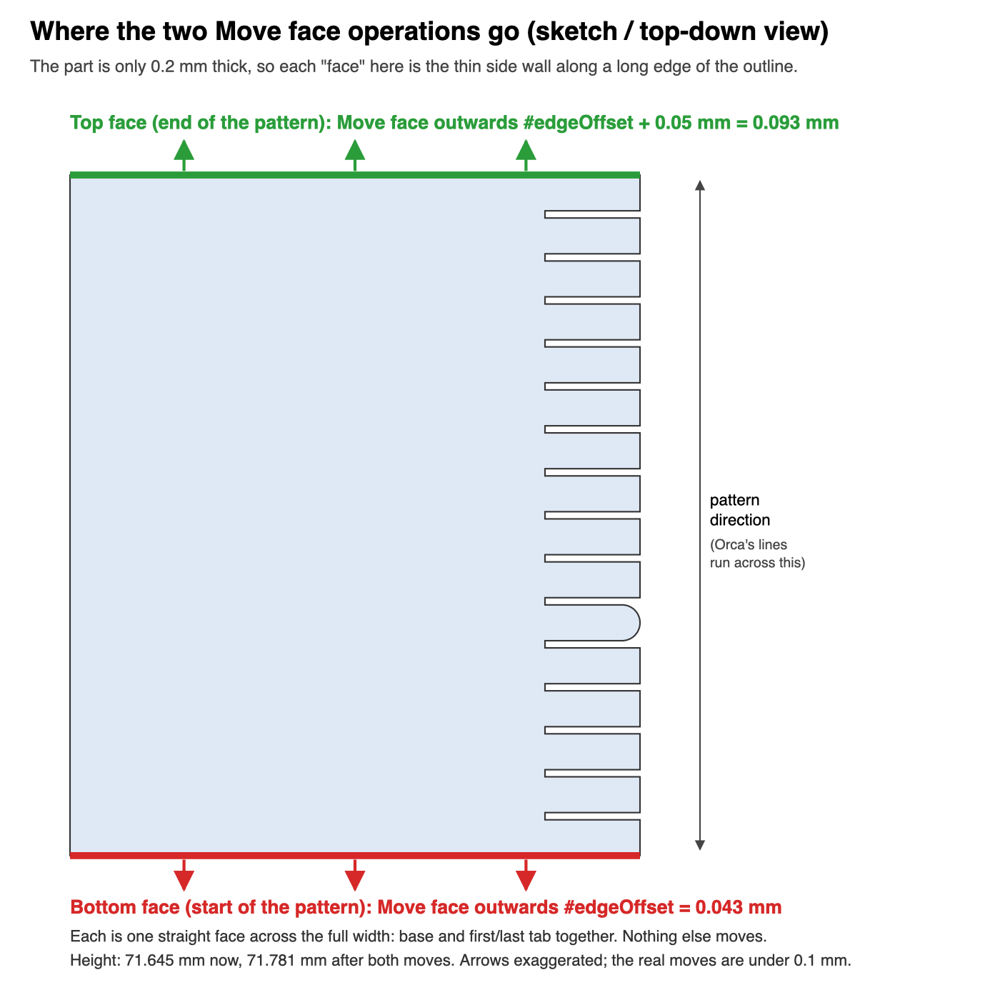
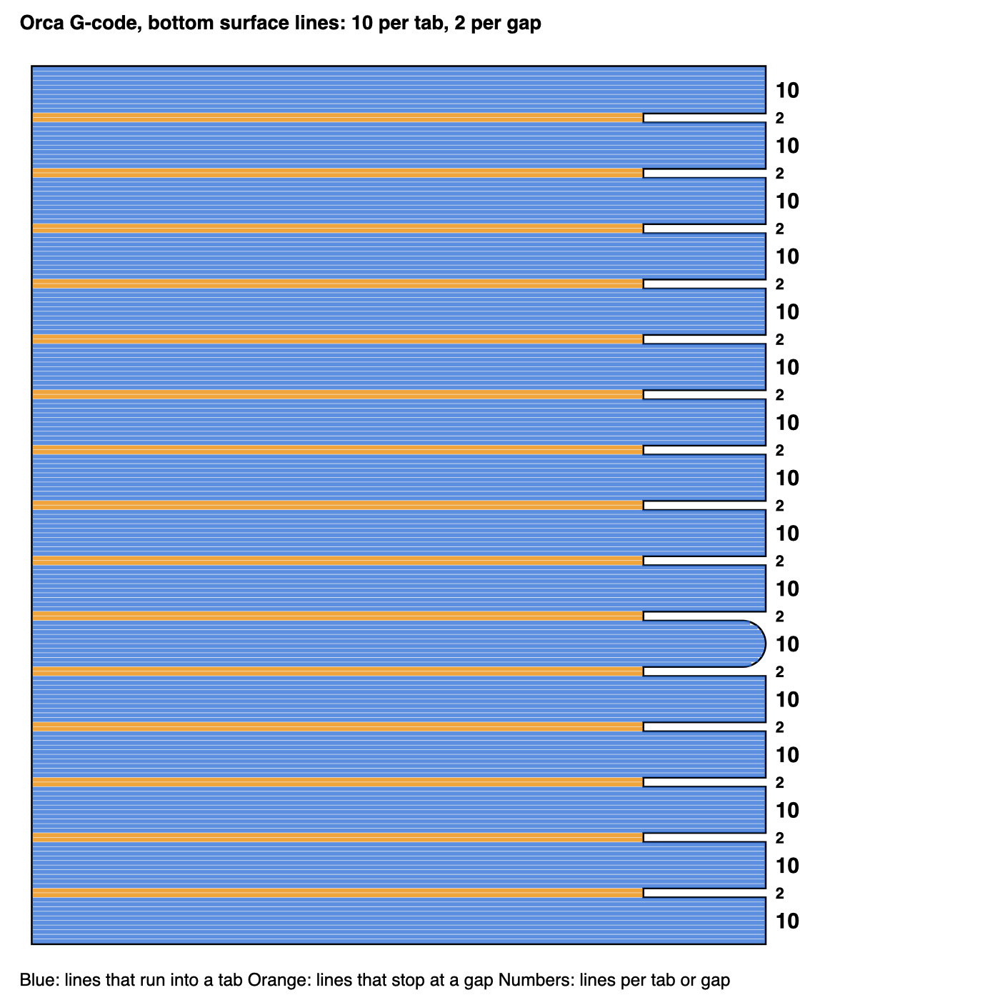

# z-offset-test

Model, Orca 3mf project and Python script for calibrating the z-offset on 3D printers.

## Files

- **`z-offset-test.py`** - Python script that detects the long and short line X values in sliced G-code and adds incremental Z-height adjustments for testing different z-offset values
- **`z-offset-test-model.step`** - 3D model with 16 test tabs: 5 closer, the current z-offset (rounded end), then 10 farther
- **`z-offset-test.3mf`** - Orca Slicer project file with pre-configured settings and post-processing script integration
- **`images/`** - Diagrams for the model geometry notes below

## How to Use

### Purpose
This tool helps calibrate the z-offset by automatically adding incremental Z-height adjustments to specific regions of your G-code. The model has 16 tabs so you can compare 5 steps closer to the bed, your current z-offset, and 10 steps farther away, all in one print. The current-offset tab is the one with a rounded end.

### Usage

#### Initial setup
Before running this test, set a rough z-offset so you are deliberately a little too close to the bed. The print then steps farther in 0.01mm increments, so starting slightly low keeps more of the useful range on the "too close" side of your current setting.

- **Klipper (probe):** Run [`PROBE_CALIBRATE`](https://www.klipper3d.org/Probe_Calibrate.html) (home first, then the command in the terminal or your front-end's calibration menu). Use the paper test at the end, but err on the tight side so the nozzle is slightly closer than you would normally leave it.
- **Klipper (Z endstop, no probe):** Same idea with [`Z_ENDSTOP_CALIBRATE`](https://www.klipper3d.org/Manual_Level.html#calibrating-a-z-endstop).
- **Other firmware / manual:** Use the paper method (or your printer's equivalent first-layer calibration). Again, pull the paper tighter than usual so you know you are a touch too close, then fine-tune with this test.

Regardless of method below, the test can be used like this:
1. Leave your current z-offset as-is once that rough setup is done (or if first layers were already roughly okay). The script starts 0.05mm closer to the bed than the sliced 0.2mm layer, then steps farther away by 0.01mm each tab.
2. Slice / process / print the model
3. Choose the best tab. Look for a flat surface with no tearing, but make sure you cannot see gaps in between the print lines. The rounded-end tab is your current z-offset (0.20mm); the five tabs before it are closer, the ten after it are farther. If several tabs look good, use the tradeoff in Tips below rather than defaulting to the middle one.
4. Modify your z-offset accordingly. Count from the rounded tab: each tab before it is 0.01mm closer to the bed, each tab after it is 0.01mm farther.
5. If every tab still looks too far from the bed (gaps between lines, no squish), your current z-offset is more than 0.05mm too high. Move it 0.05mm closer and run the test again.

#### Method 1: Orca Slicer Integration
1. Open `z-offset-test.3mf` in Orca Slicer
2. The project is pre-configured with the correct settings and post-processing script
3. Update the location of the script in the "others" tab of the process settings
4. Select your printer and filament, then slice the model and the script will automatically run when you generate the G-code

#### Method 2: Command Line
```bash
python3 z-offset-test.py <your_file.gcode>
```

### How it Works
1. The script starts processing after the `printing object` comment in the G-code (so travel and start G-code are ignored)
2. It collects the X coordinates at both ends of every extruding G1 move (travel moves are ignored, since with the Monotonic line pattern they stop near the line ends), then works out the long and short section X values automatically:
   - Unique X values are split at the midpoint between the leftmost and rightmost X
   - Only the right-hand boundary values (above that midpoint) are considered
   - The most frequent of those is the long line; the second most frequent is the short line
   - Those two values must differ by at least 5 mm
3. On a second pass, before the first tab and whenever a G1 move hits the short-line X (the gap before each later tab), the script inserts:
   - A Z-height adjustment (starting at 0.15 mm, 0.05 mm closer than the 0.2 mm layer, incrementing by 0.01 mm each time)
   - A beep command (M300) for audio feedback
4. A later G1 move that hits the long-line X, or any extruding move into the tab area, marks the end of that short section. The rounded tab's lines stop short of the long-line X, so the tab-area check is what catches it
5. This creates a 16-tab test pattern: 0.15–0.19mm (closer), 0.20mm (current, rounded-end tab), then 0.21–0.30mm (farther)

The determined long and short X values are written as comments at the top of the processed G-code.

The top of the processed G-code also says that it was modified by `z-offset-test.py`, links to this repo, and explains why. Every comment the script adds starts with `[z-offset-test.py]`, and each Z change is preceded by one, so searching the G-code for `[z-offset-test.py]` lists every height change.

If the script can't find the long and short lines, it exits with an error and leaves the G-code unchanged, so Orca shows the failure when exporting instead of silently skipping the test.

Orca only runs post-processing scripts when exporting or sending G-code. The slicer's preview always shows the unmodified G-code.

### Manual setup in slicer
These are the settings that are needed for the test script to work and for the print to show the differences of z-offset changes:
- Make sure your layer height is equal to the model height (so you get 1 layer only)
- Initial layer height: 0.2mm (the same as the layer height)
- Initial layer line width: 105% (0.42mm on a 0.4mm nozzle). The model's tab sizes are designed for this width
- Wall loops: 0
- Solid infill direction: 0
- Bottom surface pattern: Monotonic line. Plain Monotonic joins lines by running along the tab edges, which adds stray lines and gives the tabs inconsistent line counts
- Elephant foot compensation: 0. The model is a single layer, so compensation shrinks every tab and changes how many lines each tab gets
- Apply gap fill: Nowhere
- Post-processing Scripts: `[your file location]/z-offset-test/z-offset-test.py;`

### Model geometry
The model is sized so that Orca prints exactly 10 lines in every tab and 2 lines in every gap between tabs. This only works if the sizes are based on Orca's line spacing rather than the line width.

Orca models each line as a rectangle with rounded sides, so neighbouring lines overlap and are closer together than the line width. In the Onshape model the sizes come from these variables:

```text
#lineWidth   = #nozzle * 1.05                                  // 0.42 mm
#lineSpacing = #lineWidth - #layerHeight * (1 - PI / 4)        // 0.3771 mm
#edgeOffset  = #layerHeight * (1 - PI / 4)                     // 0.0429 mm
```

`#layerHeight` is the initial layer height (0.2mm), because the model is a single layer.

- Tab: `10 * #lineSpacing` (3.7708mm)
- Gap: `2 * #lineSpacing` (0.7542mm)
- Pitch: `12 * #lineSpacing` (4.5250mm). One tab and gap is sketched, extruded, then patterned 16 times, and the extra gap after the last tab is removed
- Total height: `190 * #lineSpacing + 2 * #edgeOffset + 0.05 mm` (71.781mm)

After patterning, two Move face (offset) operations are applied to the faces at each end of the pattern. Each face runs across the full width, covering the base and the end tab:

- Bottom face (start of the pattern): outwards by `#edgeOffset`
- Top face (end of the pattern): outwards by `#edgeOffset + 0.05 mm`



Why these are needed:
- Orca starts its lines `#edgeOffset` in from each outer edge. Without the offsets, the line grid doesn't line up with the tab and gap edges.
- Orca works out how many lines fit, rounds down, then stretches the spacing to fill the space. The stretch builds up along the part, and the middle tabs end up with 9 lines and gaps with 3. The extra 0.05mm on the top face keeps the space clearly above 190 lines (a 191st line would need another 0.377mm), so rounding never drops to 189.

If you change the nozzle size, line width percentage or initial layer height, update the variables and the same formulas still apply.

Sliced with the settings above, every tab gets 10 lines and every gap gets 2:



### Tips
- Check the sliced preview before printing: every tab should have 10 lines and every gap 2 (see the image above). If they differ, check the bottom surface pattern, elephant foot compensation and initial layer line width settings above
- Listen for the beeps to know when z-offset changes occur
- The first tab starts at 0.15mm (0.05mm closer than the 0.2mm layer) and increments by 0.01mm each time, through 0.30mm
- The rounded-end tab is the current z-offset (0.20mm). Count tabs from there rather than from the start of the print
- Look for a tab of correctly squished first layer, then adjust your z-offset by 0.01mm per tab away from the rounded one
- When more than one tab looks acceptable, it is a tradeoff: a little farther from the bed reduces elephant's foot and is often a good fit for PETG; a little closer improves bed adhesion, which helps with PLA. Pick where you want to sit on that balance
- If the whole print is still too far from the bed, move your z-offset 0.05mm closer and try again
